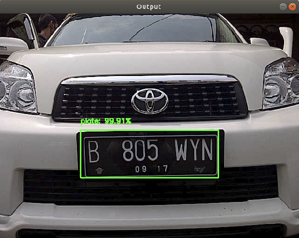

# Dependencies
- Python 3.7
- OpenCV 3.4.0

# How to run on real-time video
python real-time.py --prototxt no_bn.prototxt --model no_bn.caffemodel

# How to test on image
python real-time.py --prototxt no_bn.prototxt --model no_bn.caffemodel --image images/mobil.jpeg

